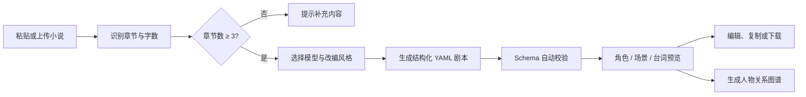

<div align="center">
  
</div>

<div align="center">

[](#changelog)
[](#quick-start)
[](#install-start)
[](#yaml-schema)
[](#testing)
[](#quick-start)

**把 3 个章节以上的小说文本，转换成可编辑、可校验、可下载的结构化 YAML 剧本。**

[功能亮点](#features) · [立即启动](#start) · [工作流程](#workflow) · [YAML 结构](#yaml-schema) · [API](#api) · [开发计划](#roadmap)

</div>

---

<a id="overview"></a>
## 项目简介

**AI 小说转剧本工具**面向小说作者、编剧和内容创作者，将章节识别、AI 改编、结构化剧本生成、YAML 校验和人物关系可视化整合到同一个 Web 工作台中。

输入小说后，你可以选择忠于原文、强化冲突或口语化等改编风格，使用本地规则模型快速演示，也可以连接七牛云 OpenAI 兼容 API 生成更自然的剧本内容。

| 小说输入 | 剧本生成 | 创作后处理 |
| :---: | :---: | :---: |
| 多章节自动识别 | 本地模型 / 七牛云 API | YAML 在线编辑 |
| TXT、Markdown、Word、图片 | 三种改编风格 | 校验、复制与下载 |
| 字数与章节统计 | 角色、场景、对白结构化 | 台词索引与人物图谱 |

<a id="features"></a>
## 功能亮点

| 能力 | 说明 |
| --- | --- |
| **多章节智能解析** | 自动识别中文数字、阿拉伯数字和 `Chapter 1` 等章节标题，统计章节与字数 |
| **双模型模式** | 本地规则模型无需 API Key；安装环境后可接入七牛云大模型 |
| **三种改编风格** | 支持忠于原文、增强戏剧冲突化和口语化表达 |
| **结构化 YAML 剧本** | 输出角色、章节、场景、动作、对白、情绪、转场等完整字段 |
| **在线编辑与历史** | 直接修改生成结果，并记录生成、编辑、恢复、复制和下载操作 |
| **Schema 自动校验** | 检查字段完整性、ID 唯一性以及章节、场景和角色引用关系 |
| **独立台词索引** | 将所有对白汇总到 `dialogue_index`，快速检查人物台词 |
| **人物关系图谱** | 根据角色同场关系生成可视化图谱，同场越多连线越明显 |
| **多格式文件输入** | 完整环境支持 TXT、Markdown、DOCX 和图片 OCR |
| **零依赖快速演示** | 仅需 Python 即可启动本地演示，不自动安装或修改任何依赖 |

<a id="workflow"></a>
## 工作流程



<a id="start"></a>
## 启动方式

项目只有两种启动方式：**快速启动**适合马上体验，**安装环境启动**适合使用完整能力。

<a id="quick-start"></a>
<details open>
<summary><strong>方式一：快速启动，零第三方依赖</strong></summary>

> 适合演示和初次体验。只需本机安装 Python 3.10+，不会创建环境、不会执行 `pip install`。

**Windows**

双击项目根目录中的 `start.bat`，或执行：

```powershell
python -m backend.dev_server --host 127.0.0.1 --port 8000
```

**macOS / Linux**

```bash
chmod +x start.sh
./start.sh
```

快速模式支持本地剧本生成、YAML 编辑与校验、人物图谱，以及 TXT、Markdown、DOCX 上传。七牛云 API 和图片 OCR 请使用方式二。

</details>

<a id="install-start"></a>
<details>
<summary><strong>方式二：安装环境启动，启用完整能力</strong></summary>

**Windows PowerShell**

```powershell
python -m venv .venv
.\.venv\Scripts\Activate.ps1
python -m pip install -r requirements.txt
python -m uvicorn backend.app:app --reload --host 127.0.0.1 --port 8000
```

如果 PowerShell 不允许激活脚本，可以直接使用虚拟环境中的 Python：

```powershell
.\.venv\Scripts\python.exe -m pip install -r requirements.txt
.\.venv\Scripts\python.exe -m uvicorn backend.app:app --reload --host 127.0.0.1 --port 8000
```

**macOS / Linux**

```bash
python3 -m venv .venv
source .venv/bin/activate
python -m pip install -r requirements.txt
python -m uvicorn backend.app:app --reload --host 127.0.0.1 --port 8000
```

</details>

启动后访问：

```text
http://127.0.0.1:8000
```

<a id="model-config"></a>
## 大模型配置

完整环境支持七牛云 OpenAI 兼容 API。复制 `.env.example` 为 `.env`，然后填写：

```env
LLM_PROVIDER=qiniu
LLM_API_KEY=your_qiniu_api_key_here
LLM_BASE_URL=https://api.qnaigc.com/v1
LLM_MODEL=deepseek-v3
LLM_USE_SYSTEM_PROXY=false
```

> [!IMPORTANT]
> 不要将真实 `.env` 文件提交到公开仓库。未配置 API Key 时，仍可使用本地演示模型。

<a id="yaml-schema"></a>
## YAML 剧本结构

项目推荐输出 `schema_version: "1.1"`。除了角色与场景，还包含按章节组织的 `chapter_scripts` 和独立对白索引 `dialogue_index`。

```yaml
schema_version: "1.1"
title: "初入县衙"
source:
  type: "novel"
  chapters:
    - id: "chapter_001"
      title: "第一章 初入县衙"

characters:
  - id: "char_001"
    name: "林安"
    role: "主角"
    description: "初入县衙、坚持查明真相的年轻县令"
    goal: "审清案件并找出幕后线索"

chapter_scripts:
  - chapter_id: "chapter_001"
    chapter_title: "第一章 初入县衙"
    scene_ids:
      - "scene_001"

scenes:
  - id: "scene_001"
    source_chapter: "chapter_001"
    title: "县衙大堂"
    location: "青石县县衙"
    time: "清晨"
    characters:
      - "char_001"
    summary: "林安开始审理第一桩案件"
    action:
      - "晨光越过堂门，林安走到案桌前坐下。"
    dialogue:
      - id: "dialogue_001"
        speaker: "char_001"
        speaker_name: "林安"
        line: "那就从第一桩开始。"
        emotion: "平静"
    transition: "切至堂下"

dialogue_index:
  - id: "dialogue_001"
    chapter_id: "chapter_001"
    chapter_title: "第一章 初入县衙"
    scene_id: "scene_001"
    speaker: "char_001"
    speaker_name: "林安"
    line: "那就从第一桩开始。"
    emotion: "平静"
```

完整字段和校验规则见 [YAML Schema 文档](docs/yaml-schema.md)。

<a id="demo"></a>
## 推荐演示流程

1. 启动项目并打开首页。
2. 点击“填入示例”，自动载入三章小说。
3. 选择本地演示模型和任一改编风格。
4. 点击“生成剧本”，查看结构化 YAML。
5. 修改一行 YAML，体验修改历史和在线校验。
6. 查看角色、场景、台词索引与人物关系图谱。
7. 复制或下载编辑后的 YAML 剧本。

<a id="structure"></a>
## 项目结构

```text
ai-novel-to-script/
├── backend/
│   ├── app.py                 # FastAPI 完整服务
│   ├── dev_server.py          # 零依赖快速启动服务
│   ├── chapter_parser.py      # 小说章节解析
│   ├── file_parser.py         # 文件与图片文本提取
│   ├── script_generator.py    # 剧本生成编排
│   ├── yaml_codec.py          # YAML 编解码与标准库兜底
│   ├── yaml_validator.py      # YAML Schema 校验
│   ├── graph_builder.py       # 人物关系图谱
│   ├── llm_client.py          # 七牛云大模型客户端
│   ├── templates/             # Web 页面
│   └── static/                # CSS 与 JavaScript
├── docs/                      # Schema 与开发文档
├── examples/                  # 示例小说和 YAML
├── tests/                     # 自动化测试
├── start.bat                  # Windows 快速启动
├── start.sh                   # macOS / Linux 快速启动
├── QUICK_START.md
├── requirements.txt
└── README.md
```

<a id="api"></a>
## API 接口

| 方法 | 路径 | 功能 |
| --- | --- | --- |
| `GET` | `/` | Web 工作台首页 |
| `GET` | `/health` | 服务健康检查 |
| `GET` | `/api/models` | 获取可用模型 |
| `GET` | `/api/example` | 获取示例小说 |
| `POST` | `/api/extract-text` | 从上传文件提取文本 |
| `POST` | `/api/parse-chapters` | 解析章节和字数 |
| `POST` | `/api/generate-script` | 生成 YAML 剧本 |
| `POST` | `/api/validate-yaml` | 校验 YAML 结构 |
| `POST` | `/api/character-graph` | 生成人物关系图谱 |

剧本生成请求示例：

```json
{
  "novel_text": "第一章……第二章……第三章……",
  "style": "影视剧本",
  "language": "zh-CN",
  "provider": "local",
  "model": "local-rule",
  "adaptation_style": "faithful"
}
```

`adaptation_style` 支持 `faithful`、`dramatic` 和 `colloquial`。

<a id="testing"></a>
## 测试

安装依赖后执行：

```bash
python -m pytest
```

当前测试覆盖章节识别、角色名提取、YAML 生成与校验、人物图谱，以及零依赖快速启动路径。

<a id="changelog"></a>
## 版本亮点

<details open>
<summary><strong>v0.3.1</strong></summary>

- 修复本地模型将“苦笑、朗声、沉声”等动作或语气误识别为角色名的问题。
- 结构化预览聚焦角色、场景和台词，章节结构继续完整保留在 `chapter_scripts`。
- 快速启动改为真正的零第三方依赖模式，不再自动安装 requirements。
- 保留独立台词索引、YAML 在线编辑、修改历史和三种改编风格。

</details>

<a id="original-work"></a>
## 原创设计

- 剧本 YAML Schema 与引用校验规则
- 多格式章节识别和章节统计逻辑
- 小说转剧本 Prompt 与本地规则生成策略
- 角色、场景、对白、章节和台词索引的结构化编排
- YAML 在线编辑、历史记录、复制与下载交互
- 基于同场关系的人物图谱生成
- 零依赖演示服务与完整 FastAPI 服务双启动架构

<a id="roadmap"></a>
## 后续计划

- [ ] 支持 PDF 文本提取与扫描件 OCR
- [ ] 支持单场景局部重新生成
- [ ] 支持 Markdown、JSON 等更多导出格式
- [ ] 支持拖拽式人物关系图谱
- [ ] 支持用户自定义 YAML Schema
- [ ] 接入更多大模型供应商

---

<div align="center">
  <strong>让故事先成为结构，再让结构走向片场。</strong>
  <br>
  <sub>Built with Python, FastAPI, YAML and a little screenwriter energy.</sub>
</div>
