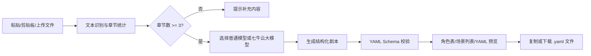

<div align="center">
  <p>
    
  </p>

  <h1>AI 小说转剧本工具</h1>
  <p><strong>面向小说作者、编剧和 Demo 评审的 AI 辅助剧本创作 Web 工具</strong></p>

  <p>
    
    
    
    
    
  </p>

  <p>
    <a href="#-快速开始">快速开始</a> |
    <a href="#-核心功能">核心功能</a> |
    <a href="#-大模型配置">大模型配置</a> |
    <a href="#-接口设计">接口设计</a> |
    <a href="docs/yaml-schema.md">YAML Schema</a>
  </p>
</div>

---

## ✨ 项目亮点

> 很多小说作者希望将自己的作品改编成剧本。本项目把“章节解析、AI 分析、结构化剧本、Schema 校验、在线预览、YAML 下载”整合成一个可直接演示的网页工具。

| 能力 | 说明 |
| --- | --- |
| 聊天式工作台 | 左侧项目与历史记录，中间对话输出，底部输入与上传 |
| 多源输入 | 支持手动粘贴、读取剪贴板、上传 `.txt/.docx/.pdf` 文件 |
| 多章节识别 | 支持 `第一章`、`第1章`、`Chapter 1`、`一、开端` 等常见章节格式 |
| 双模式生成 | `普通模型（本地）` 可离线演示，`大模型（七牛云）` 调用真实 AI |
| 结构化剧本 | 自动输出角色表、场景列表、动作、对白、情绪和转场 |
| YAML 校验 | 生成后自动校验必填字段、ID 唯一性、章节引用和角色引用 |
| 多视图预览 | 前端支持 YAML 原文、角色表、场景列表三种视图 |
| 工程完整度 | 包含示例小说、示例输出、Schema 文档、测试与运行说明 |

## 🧭 工作流程



## 🚀 快速开始

<details open>
<summary><strong>方式一：零依赖演示服务器</strong></summary>

适合当前机器还没有安装 FastAPI 时快速体验：

```bash
python -m backend.dev_server --host 127.0.0.1 --port 8000
```

打开浏览器访问：

```text
http://127.0.0.1:8000
```

</details>

<details>
<summary><strong>方式二：FastAPI 正式运行</strong></summary>

```bash
python -m venv .venv
.venv\Scripts\activate
pip install -r requirements.txt
uvicorn backend.app:app --reload --host 127.0.0.1 --port 8000
```

</details>

## 🧠 大模型配置

页面提供两种生成模式：

| 模式 | 是否联网 | 适用场景 |
| --- | --- | --- |
| 普通模型（本地） | 否 | 课堂展示、比赛 Demo、无 API Key 环境 |
| 大模型（七牛云） | 是 | 使用七牛云 DeepSeek 模型生成更自然的剧本 |

复制 `.env.example` 为 `.env`，然后填写七牛云配置：

```env
LLM_PROVIDER=qiniu
LLM_API_KEY=your_qiniu_api_key_here
LLM_BASE_URL=https://api.qnaigc.com/v1
LLM_MODEL=deepseek-v3
LLM_TIMEOUT=60
LLM_USE_SYSTEM_PROXY=false
```

> 注意：`LLM_BASE_URL` 填到 `/v1` 即可，程序会自动请求 `/chat/completions`。不要填成 `/v1/messages`。

如果你的电脑代理可用，可以把 `LLM_USE_SYSTEM_PROXY` 改成 `true`；默认 `false` 是为了避免无效代理导致 `[WinError 10061]`。

## 🧩 核心功能

<details open>
<summary><strong>小说输入与章节解析</strong></summary>

- 支持直接粘贴小说文本
- 支持一键读取剪贴板文本
- 支持上传 `.txt/.docx/.pdf` 并自动提取正文
- 实时统计字数与章节数量
- 自动拆分章节 ID、标题、正文、字数和摘要
- 少于 3 个章节时禁止生成并给出清晰提示

</details>

<details open>
<summary><strong>剧本生成与 YAML 输出</strong></summary>

- 自动生成剧本标题、来源章节、角色表和场景列表
- 场景包含时间、地点、出场人物、动作、对白、情绪和转场
- 支持复制 YAML 与下载 `.yaml` 文件

</details>

<details open>
<summary><strong>Schema 校验与修复</strong></summary>

- 校验 YAML 是否可解析
- 校验顶层必填字段
- 校验角色 ID、场景 ID、章节引用和对白说话人
- 对缺失字段提供轻量自动修复能力

</details>

## 🏗️ 项目结构

```text
backend/
  app.py                  FastAPI 应用入口
  dev_server.py           零依赖本地演示服务器
  config.py               环境变量与模型配置
  llm_client.py           OpenAI 兼容大模型客户端
  chapter_parser.py       小说章节解析
  script_generator.py     剧本生成编排
  yaml_codec.py           YAML 编解码
  yaml_validator.py       YAML Schema 校验
  prompt_templates.py     大模型提示词模板
  templates/index.html    前端页面
  static/                 CSS 与 JavaScript
docs/
  yaml-schema.md          YAML Schema 设计文档
  development-plan.md     开发计划与记录
examples/
  novel_sample.txt        示例小说文本
  script_output.yaml      示例剧本输出
tests/
  test_chapter_parser.py
  test_config.py
  test_yaml_validator.py
```

## 🔌 接口设计

| 方法 | 路径 | 功能 |
| --- | --- | --- |
| `GET` | `/` | 返回网页首页 |
| `GET` | `/api/example` | 读取示例小说 |
| `POST` | `/api/extract-text` | 从 `.txt/.docx/.pdf` 上传文件中提取文本 |
| `POST` | `/api/parse-chapters` | 解析章节数量与章节信息 |
| `POST` | `/api/generate-script` | 生成 YAML 剧本 |
| `POST` | `/api/validate-yaml` | 校验 YAML 是否符合 Schema |

示例请求：

```json
{
  "novel_text": "第一章 ... 第二章 ... 第三章 ...",
  "style": "影视剧本",
  "language": "zh-CN",
  "adaptation_mode": "忠于原文",
  "detail_level": "标准",
  "model_mode": "llm"
}
```

## ✅ 测试

项目核心逻辑使用标准库 `unittest`：

```bash
python -m unittest discover -s tests
```

当前覆盖：

- 章节识别
- 文本文件与 Word 文件提取
- YAML 生成与校验
- 七牛云默认配置
- 错误 base_url 自动归一化
- 普通模型本地生成模式

## 📄 文档

| 文档 | 说明 |
| --- | --- |
| [docs/yaml-schema.md](docs/yaml-schema.md) | YAML Schema 字段、校验规则与设计原因 |
| [docs/development-plan.md](docs/development-plan.md) | 开发阶段、功能增强方向与记录 |
| [examples/novel_sample.txt](examples/novel_sample.txt) | 原创示例小说文本 |
| [examples/script_output.yaml](examples/script_output.yaml) | 示例 YAML 剧本输出 |

## 🛠️ 常见问题

<details>
<summary><strong>大模型接口连接失败：[WinError 10061]</strong></summary>

通常是系统代理不可用或 `LLM_BASE_URL` 写错。请确认：

```env
LLM_BASE_URL=https://api.qnaigc.com/v1
LLM_USE_SYSTEM_PROXY=false
```

</details>

<details>
<summary><strong>PDF 上传后提示无法识别</strong></summary>

PDF 解析依赖 `pypdf`。请先安装依赖：

```bash
pip install -r requirements.txt
```

如果 PDF 是扫描图片，普通 PDF 文本解析无法识别，需要先 OCR。

</details>

<details>
<summary><strong>章节数量不足，无法生成</strong></summary>

输入文本至少需要 3 个章节。支持的章节标题示例：

```text
第一章 雨夜重逢
第2章 旧仓库
Chapter 3 Rooftop
一、开端
```

</details>

## 🗺️ 后续计划

- 增加单场景重新生成
- 增加 Markdown、JSON、TXT 导出
- 增加章节到场景的映射视图
- 增加 Demo 截图与演示视频链接
- 增加更细的 Prompt 调试面板

---

<div align="center">
  <strong>让小说先变成结构，再让创作继续发光。</strong>
  <br>
  <sub>Built with Python, YAML and a little screenwriter energy.</sub>
</div>
