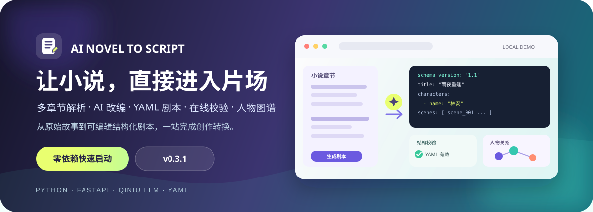
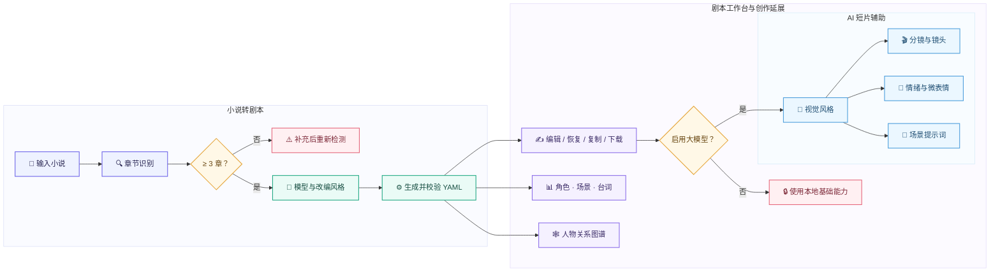
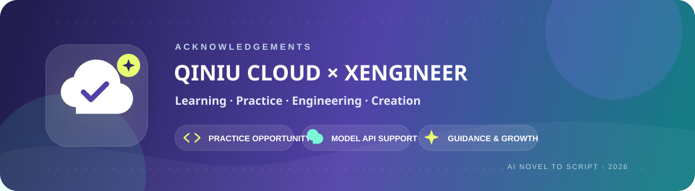

<div align="center">
  
</div>

<div align="center">

[](#version-history)
[](#quick-start)
[](#full-start)
[](#yaml-schema)
[](#testing)
[](#start)

**把 3 个章节以上的小说文本，转换为可编辑、可校验、可下载的结构化 YAML 剧本。**

[功能亮点](#features) · [Windows 启动](#start) · [工作流程](#workflow) · [YAML 结构](#yaml-schema) · [版本记录](#version-history) · [后续计划](#roadmap) · [致谢](#acknowledgements)

</div>

---

## 🎬 Demo 演示视频

<table align="center">
  <tr>
    <td align="center">
      <strong>🎥 小说转剧本 Demo</strong>
      <br><br>
      <a href="https://b23.tv/4tP55LG"><strong>▶ 前往 B 站观看演示视频</strong></a>
    </td>
  </tr>
</table>

## 🚀 v0.4 升级说明

v0.4 将产品从“结构化剧本生成与编辑”继续延伸到“人物关系理解与 AI 短片前期准备”：

1. **🤝 关系图谱更有叙事含义**：根据场景摘要、动作和对白判断友好、敌对或中性关系，并以绿色、红色、灰色区分。
2. **🎞️ 新增 AI 短片辅助**：使用七牛云大模型生成分镜建议、镜头提示词、角色情绪、微表情和场景描绘提示词。
3. **🎨 新增视觉风格控制**：支持漫剧、真人短剧、电影感和动画四种提示词方向。
4. **🧠 明确模型能力边界**：本地演示模型负责稳定生成 YAML；短片辅助仅在已选择并配置大模型时启用。
5. **📊 升级结构化预览界面**：角色、场景和台词索引使用数据表展示，强化字段层级、状态标识、空状态和窄屏浏览体验。
6. **📝 校正文档与实际能力**：启动说明仅保留当前仓库真实可用的 Windows 命令行方式，不再描述不存在的 `start.bat` 或其他平台脚本。

## 📖 项目简介

**AI 小说转剧本工具**面向小说作者、短剧创作者和 AI 视频创作者，将章节识别、AI 改编、结构化剧本生成、YAML 校验、在线编辑、人物关系可视化与短片提示词准备整合到同一个 Web 工作台。

输入小说后，可以选择忠于原文、增强戏剧冲突或口语化三种改编风格。未配置 API Key 时可使用本地规则模型完成稳定演示；配置七牛云 OpenAI 兼容 API 后，可生成更自然的剧本和 AI 短片辅助内容。

<table align="center">
  <thead>
    <tr>
      <th align="center">📚 小说输入</th>
      <th align="center">🛠️ 剧本工作台</th>
      <th align="center">🎬 创作延展</th>
    </tr>
  </thead>
  <tbody>
    <tr>
      <td align="center">多章节自动识别</td>
      <td align="center">YAML 在线编辑与校验</td>
      <td align="center">友好/敌对关系图谱</td>
    </tr>
    <tr>
      <td align="center">TXT、Markdown、DOCX</td>
      <td align="center">角色、场景、台词表格</td>
      <td align="center">分镜与镜头提示词</td>
    </tr>
    <tr>
      <td align="center">字数与章节统计</td>
      <td align="center">修改历史、复制与下载</td>
      <td align="center">情绪、微表情、场景提示词</td>
    </tr>
  </tbody>
</table>

<a id="features"></a>
## ✨ 功能亮点

<table align="center">
  <thead>
    <tr>
      <th align="center">能力</th>
      <th align="center">当前实现</th>
    </tr>
  </thead>
  <tbody>
    <tr><td align="center"><strong>📚 多章节解析</strong></td><td>识别“第一章”“第 1 章”“Chapter 1”等标题并统计章节、字数</td></tr>
    <tr><td align="center"><strong>🧠 双模型模式</strong></td><td>本地规则模型无需 API Key；七牛云 API 使用 OpenAI 兼容协议</td></tr>
    <tr><td align="center"><strong>🎭 三种改编风格</strong></td><td>忠于原文、增强戏剧冲突化、口语化</td></tr>
    <tr><td align="center"><strong>🧩 YAML Schema 1.1</strong></td><td>输出角色、章节映射、场景、动作、对白、情绪、转场和台词索引</td></tr>
    <tr><td align="center"><strong>✍️ 编辑闭环</strong></td><td>在线编辑、重新校验、恢复生成版、修改历史、复制和下载</td></tr>
    <tr><td align="center"><strong>🛡️ 引用校验</strong></td><td>检查必填字段、ID 唯一性及章节、场景、角色引用关系</td></tr>
    <tr><td align="center"><strong>📊 结构化数据表</strong></td><td>分栏查看角色、场景和台词索引，长内容支持滚动浏览</td></tr>
    <tr><td align="center"><strong>🕸️ 关系语义图谱</strong></td><td>输出 <code>friendly</code>、<code>hostile</code>、<code>neutral</code> 关系、颜色、权重和依据</td></tr>
    <tr><td align="center"><strong>🎞️ AI 短片辅助</strong></td><td>生成分镜、镜头、情绪、微表情和场景提示词</td></tr>
    <tr><td align="center"><strong>🚦 两种运行模式</strong></td><td>标准库快速体验服务，以及安装依赖后的 FastAPI 完整服务</td></tr>
  </tbody>
</table>

<a id="workflow"></a>
## 🔄 工作流程



<a id="start"></a>
## 🖥️ Windows 启动

> 当前仓库**没有 `start.bat`**，快速启动和完整启动都需要在项目根目录打开 PowerShell 或终端执行命令。

<a id="quick-start"></a>
### ⚡ 方式一：快速体验

只要求 Windows 已安装 Python 3.10+。该模式不创建虚拟环境，也不执行 `pip install`。

```powershell
python -m backend.dev_server --host 127.0.0.1 --port 8000
```

如需在启动前交互式配置七牛云 API（建议把文件.env.example修改为.env后手动配置大模型apikey）：

```powershell
python -m backend.dev_server --setup-qiniu --host 127.0.0.1 --port 8000
```

快速模式支持：

- 本地规则模型和已配置的七牛云 API；
- TXT、Markdown、DOCX 上传；
- YAML 生成、编辑、校验、复制与下载；
- 结构化表格、人物关系图谱和 AI 短片辅助。

快速模式不包含图片 OCR。图片识别请使用完整模式，并在 Windows 安装 Tesseract OCR。

<a id="full-start"></a>
### 🧰 方式二：完整环境

```powershell
python -m venv .venv
.\.venv\Scripts\Activate.ps1
python -m pip install -r requirements.txt
python -m uvicorn backend.app:app --reload --host 127.0.0.1 --port 8000
```

如果 PowerShell 不允许激活脚本，可直接使用虚拟环境中的 Python：

```powershell
.\.venv\Scripts\python.exe -m pip install -r requirements.txt
.\.venv\Scripts\python.exe -m uvicorn backend.app:app --reload --host 127.0.0.1 --port 8000
```

启动后访问：

```text
http://127.0.0.1:8000
```

### ☁️ 七牛云配置

复制 `.env.example` 为 `.env`，并填写：

```env
LLM_PROVIDER=qiniu
LLM_API_KEY=your_qiniu_api_key_here
LLM_BASE_URL=https://api.qnaigc.com/v1
LLM_MODEL=deepseek-v3
LLM_USE_SYSTEM_PROXY=false
```

> [!IMPORTANT]
> 不要提交包含真实 API Key 的 `.env`。未配置 API Key 时，页面会默认使用本地演示模型。

<a id="yaml-schema"></a>
## 🧩 YAML 剧本结构

项目当前使用 `schema_version: "1.1"`，通过稳定 ID 维护章节、角色、场景和对白之间的引用关系。

```yaml
schema_version: "1.1"
title: "初入县衙"
source:
  type: "novel"
  chapters:
    - id: "chapter_001"
      title: "第一章 初入县衙"

characters:
  - id: "char_001"
    name: "林安"
    role: "主角"
    description: "坚持查明真相的年轻县令"
    goal: "审清案件并找出幕后线索"

chapter_scripts:
  - chapter_id: "chapter_001"
    chapter_title: "第一章 初入县衙"
    scene_ids:
      - "scene_001"

scenes:
  - id: "scene_001"
    source_chapter: "chapter_001"
    title: "县衙大堂"
    location: "青石县县衙"
    time: "清晨"
    characters:
      - "char_001"
    summary: "林安开始审理第一桩案件"
    action:
      - "晨光越过堂门，林安走到案桌前坐下。"
    dialogue:
      - id: "dialogue_001"
        speaker: "char_001"
        speaker_name: "林安"
        line: "那就从第一桩开始。"
        emotion: "平静"
    transition: "切至堂下"

dialogue_index:
  - id: "dialogue_001"
    chapter_id: "chapter_001"
    scene_id: "scene_001"
    speaker: "char_001"
    speaker_name: "林安"
    line: "那就从第一桩开始。"
    emotion: "平静"
```

完整字段与校验规则见 [YAML Schema 文档](docs/yaml-schema.md)。

## 🎬 推荐演示流程

1. 使用快速体验命令启动项目并打开首页。
2. 点击“填入示例”，自动载入三章小说。
3. 选择本地演示模型和任一改编风格。
4. 生成剧本，查看 YAML、校验结果和结构化表格。
5. 修改 YAML 后执行“校验编辑版”，观察修改历史与图谱同步刷新。
6. 配置七牛云 API 后，选择视频风格并生成短片辅助建议。
7. 复制或下载编辑后的 YAML。

## 📁 项目结构

```text
novel-to-script/
├── backend/
│   ├── app.py                 # FastAPI 完整服务
│   ├── dev_server.py          # Python 标准库快速体验服务
│   ├── chapter_parser.py      # 章节解析
│   ├── file_parser.py         # 文件与图片文本提取
│   ├── script_generator.py    # 剧本生成编排
│   ├── yaml_codec.py          # YAML 编解码与标准库兜底
│   ├── yaml_validator.py      # Schema 与引用校验
│   ├── graph_builder.py       # 人物关系语义图谱
│   ├── visual_assistant.py    # AI 短片辅助
│   ├── llm_client.py          # 七牛云兼容 API 客户端
│   ├── templates/
│   └── static/
├── docs/
├── examples/
├── tests/
├── QUICK_START.md
├── requirements.txt
└── README.md
```

## 🔌 API 接口

<table align="center">
  <thead>
    <tr>
      <th align="center">方法</th>
      <th align="center">路径</th>
      <th align="center">功能</th>
    </tr>
  </thead>
  <tbody>
    <tr><td align="center">🟢 <code>GET</code></td><td align="center"><code>/</code></td><td>Web 工作台首页</td></tr>
    <tr><td align="center">🟢 <code>GET</code></td><td align="center"><code>/health</code></td><td>服务健康检查</td></tr>
    <tr><td align="center">🟢 <code>GET</code></td><td align="center"><code>/api/models</code></td><td>获取模型方案与配置状态</td></tr>
    <tr><td align="center">🟢 <code>GET</code></td><td align="center"><code>/api/example</code></td><td>获取示例小说</td></tr>
    <tr><td align="center">🟠 <code>POST</code></td><td align="center"><code>/api/extract-text</code></td><td>从上传文件提取文本</td></tr>
    <tr><td align="center">🟠 <code>POST</code></td><td align="center"><code>/api/parse-chapters</code></td><td>解析章节和字数</td></tr>
    <tr><td align="center">🟠 <code>POST</code></td><td align="center"><code>/api/generate-script</code></td><td>生成、校验 YAML 并返回图谱</td></tr>
    <tr><td align="center">🟠 <code>POST</code></td><td align="center"><code>/api/validate-yaml</code></td><td>校验编辑后的 YAML</td></tr>
    <tr><td align="center">🟠 <code>POST</code></td><td align="center"><code>/api/character-graph</code></td><td>生成人物关系图谱</td></tr>
    <tr><td align="center">🟠 <code>POST</code></td><td align="center"><code>/api/video-assist</code></td><td>生成分镜、情绪和场景提示词</td></tr>
  </tbody>
</table>

<a id="testing"></a>
## ✅ 测试

安装依赖后执行：

```powershell
python -m pytest -q
```

仓库目前包含 13 个测试用例，覆盖章节识别、角色名清洗、YAML 生成与校验、关系图谱、v0.3 编辑数据结构、v0.4 模型边界和快速体验路径。

<a id="version-history"></a>
## 🏷️ 版本亮点

<table align="center">
  <thead>
    <tr>
      <th align="center">版本</th>
      <th align="center">产品阶段</th>
      <th align="center">主要变化</th>
    </tr>
  </thead>
  <tbody>
    <tr><td align="center"><strong>🌱 v0.1 MVP</strong></td><td align="center">核心链路验证</td><td>完成多章小说输入、AI/规则生成、YAML 展示与下载，建立首版 Schema 和测试样本</td></tr>
    <tr><td align="center"><strong>🧭 v0.2 增强版</strong></td><td align="center">演示与可视化</td><td>新增 TXT/Markdown/DOCX/图片输入、双模型切换、复制下载反馈、Schema 校验、角色与场景预览、人物关系图谱</td></tr>
    <tr><td align="center"><strong>✍️ v0.3 编辑增强版</strong></td><td align="center">可编辑工作台</td><td>新增 YAML 在线编辑、恢复与修改历史；Schema 升级至 1.1，加入 <code>chapter_scripts</code>、<code>dialogue_index</code> 和三种改编风格</td></tr>
    <tr><td align="center"><strong>🛠️ v0.3.1 修复版</strong></td><td align="center">生成质量回归</td><td>修复“苦笑、朗声、沉声”等动作或语气被误识别为角色名的问题，并精简重复的章节预览</td></tr>
    <tr><td align="center"><strong>🎬 v0.4 AI 短片辅助版</strong></td><td align="center">创作延展</td><td>图谱升级为友好/敌对/中性语义关系；新增分镜、镜头、情绪、微表情、场景提示词和四种视觉风格</td></tr>
  </tbody>
</table>

## 💡 原创设计与实现

以下内容为本项目围绕“小说转结构化剧本”场景完成的原创设计与工程实现，第三方框架和依赖不在此范围内：

- **🧩 Schema 与引用模型**：设计角色、章节、场景、对白的稳定 ID 体系，以及跨字段引用校验规则。
- **🔀 双生成策略**：同一套业务接口同时支持可离线演示的规则生成和七牛云大模型生成。
- **🛡️ YAML 可靠性链路**：约束 Prompt、剥离代码围栏、Schema 校验、错误反馈和模型修复 Prompt 组成闭环。
- **🔄 编辑态数据闭环**：校验、复制、下载、图谱和短片辅助均读取用户当前编辑后的 YAML，而不是只使用首次生成结果。
- **🔗 关系语义推断**：结合角色同场次数与剧情关键词，输出关系类型、颜色、权重和证据。
- **🎞️ 短片辅助数据契约**：将剧本场景映射为 `storyboard`、`emotions`、`scene_prompts` 三类可继续用于 AI 视频创作的结构化结果。
- **🏗️ 双服务架构**：标准库服务保障低门槛体验，FastAPI 服务承载完整依赖能力，两者复用同一套核心业务模块。
- **🖥️ 单页创作工作台**：围绕输入、生成、编辑、校验、预览、图谱和创作延展组织完整交互流程。

<a id="roadmap"></a>
## 🗺️ 后续计划

- [ ] 增加可靠的 Windows 一键启动脚本，并补充端口占用、Python 检测和启动失败提示
- [ ] 支持按单个场景重新生成剧本或短片辅助内容
- [ ] 支持手动修正人物关系并写回 YAML
- [ ] 导出 Markdown、JSON、CSV 和分镜表格
- [ ] 支持双语或英文视频生成提示词
- [ ] 支持 PDF 文本提取与扫描件 OCR
- [ ] 增加可拖拽图谱、分镜排序和镜头时间轴
- [ ] 接入更多 OpenAI 兼容模型供应商
- [ ] 对接图片/视频生成平台，生成角色设定图、场景关键帧或短片草稿
- [ ] 增加本地项目保存、版本对比和自动恢复能力

<a id="acknowledgements"></a>
## 🙏 致谢

<div align="center">
  
</div>

<br>

<table align="center">
  <thead>
    <tr>
      <th align="center">🌱 实践机会</th>
      <th align="center">☁️ 模型支持</th>
      <th align="center">🤝 指导与陪伴</th>
    </tr>
  </thead>
  <tbody>
    <tr>
      <td align="center">感谢 <strong>七牛云 × XEngineer 暑期实训营</strong> 提供宝贵的学习与项目实践机会，让我们能够完成从需求分析、功能开发到项目交付的完整实践。</td>
      <td align="center">特别感谢 <strong>七牛云</strong> 提供大模型 API Key 与模型服务支持，帮助本项目完成真实模型调用、剧本生成和 AI 短片辅助能力的开发与验证。</td>
      <td align="center">感谢伙伴们在项目实践过程中给予的指导、建议、交流与陪伴。</td>
    </tr>
  </tbody>
</table>

<div align="center">
  <sub>每一次实践，都是让想法真正成为作品的机会。</sub>
</div>

---

<div align="center">
  <strong>让故事先成为结构，再让结构走向片场。</strong>
  <br>
  <sub>Built with Python, FastAPI and YAML.</sub>
</div>
